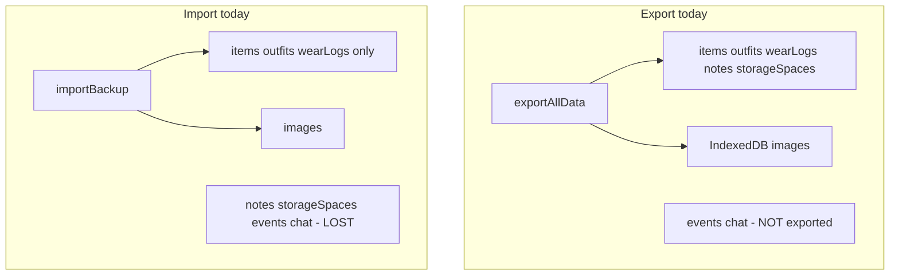
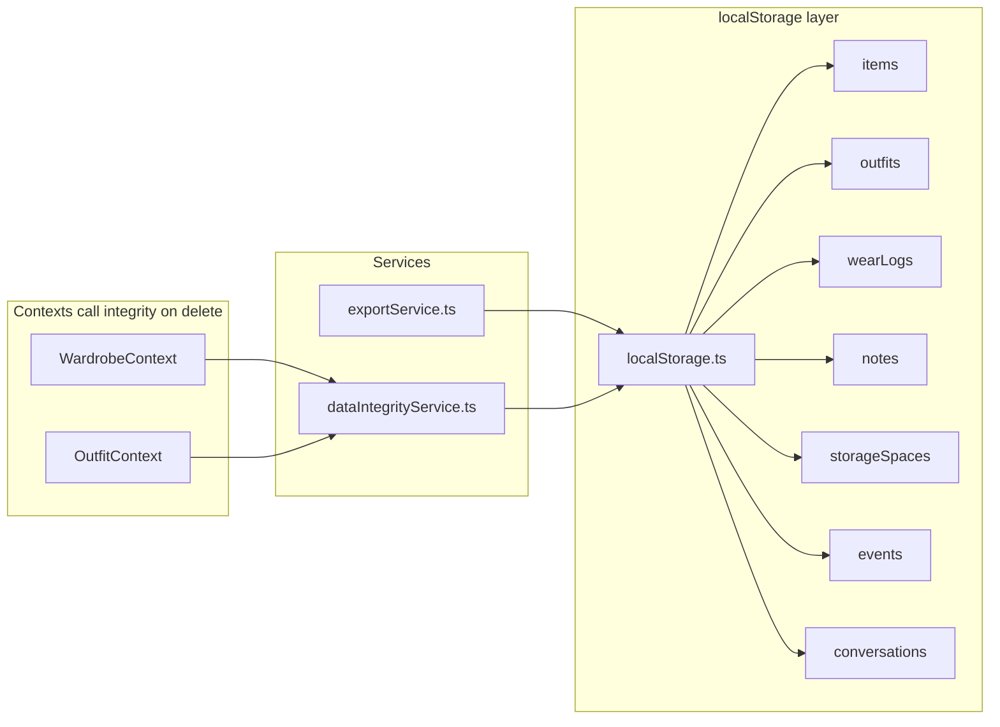

# Data Fixes + Full Backup

## Current problems


| Issue                                                       | Where                                                                                                                                                                   | Impact                                        |
| ----------------------------------------------------------- | ----------------------------------------------------------------------------------------------------------------------------------------------------------------------- | --------------------------------------------- |
| Export includes notes + storage spaces, import ignores them | `[exportService.ts](src/services/exportService.ts)` L75-79 vs `[localStorage.ts](src/services/storage/localStorage.ts)` L179-198                                        | Partial restore loses organization data       |
| Events + chat never exported/imported/cleared               | `[EventContext.tsx](src/contexts/EventContext.tsx)`, `[ChatContext.tsx](src/contexts/ChatContext.tsx)`, `[clearAllData](src/services/storage/localStorage.ts)` L202-208 | Calendar events and AI history lost on import |
| Item image ignored on edit                                  | `[ItemForm.tsx](src/components/wardrobe/ItemForm.tsx)` L124-139, `[WardrobeContext.tsx](src/contexts/WardrobeContext.tsx)` L27                                          | Can't fix bad photos                          |
| Item delete leaves orphans                                  | `[WardrobeContext.tsx](src/contexts/WardrobeContext.tsx)` L99-106                                                                                                       | Broken outfit canvas, ghost wear-log refs     |
| Outfit delete leaves orphans                                | `[OutfitContext.tsx](src/contexts/OutfitContext.tsx)` L50-53                                                                                                            | Events/wear logs point to missing outfits     |
| Storage space only assignable on Organize page              | `[OrganizePage.tsx](src/pages/OrganizePage.tsx)` only writer of `storageSpaceId`                                                                                        | Incomplete item metadata                      |
| Settings copy understates scope                             | `[SettingsPage.tsx](src/pages/SettingsPage.tsx)` L57-59                                                                                                                 | Misleading UX                                 |





---

## Target architecture

Centralize all localStorage collections in one layer and add a small integrity service that contexts call on delete/import.




---

## Implementation plan

### 1. Unify localStorage for events + chat

Move event/conversation CRUD from inline localStorage calls into `[localStorage.ts](src/services/storage/localStorage.ts)` (same pattern as notes/storage spaces):

- Add `getEvents` / `setEvents` / `addEvent` / `updateEvent` / `deleteEvent`
- Add `getConversations` / `setConversations` / helpers used by ChatContext
- Refactor `[EventContext.tsx](src/contexts/EventContext.tsx)` and `[ChatContext.tsx](src/contexts/ChatContext.tsx)` to use the shared module (no behavior change, just consolidation)

Update `[StorageData](src/types/index.ts)` to include `events` and `conversations`.

### 2. Define a versioned backup format

Add to `[constants.ts](src/utils/constants.ts)`:

```ts
export const BACKUP_FORMAT_VERSION = 2;
```

Update `[exportService.ts](src/services/exportService.ts)` with a typed `BackupData` interface:

```ts
interface BackupData {
  formatVersion: number;      // 2
  storageVersion: number;     // CURRENT_VERSION
  items, outfits, wearLogs, notes, storageSpaces,
  events, conversations,
  images: { id, data, thumbnail, createdAt }[],
  exportedAt: string;
}
```

**Export:** spread full `exportAllData()` + conversations + events + images.

**Import (backward compatible):**

- Accept backups missing `formatVersion` (treat as v1)
- Default missing arrays to `[]` (events, conversations, notes, storageSpaces)
- Pass all collections to `importData()`
- Restore images as today
- Run integrity repair (step 4)
- Reload page (keep existing pattern in Settings)

**Clear:** extend `clearAllData()` to also remove `EVENTS` and `CHAT_CONVERSATIONS` keys.

### 3. Fix image replacement on edit

Extend `[WardrobeContext.tsx](src/contexts/WardrobeContext.tsx)`:

- Change `updateItem` to `updateItem(id, updates, image?: File)` (or accept `image` inside updates with a separate code path)
- When `image` is provided:
  1. `compressImage` + `generateThumbnail`
  2. `saveImage(existingImageId, ...)` — reuse same `imageId` via IndexedDB `put` (no orphan blobs)
- Make `updateItem` async (like `addItem`) since image processing is async

Update `[ItemForm.tsx](src/components/wardrobe/ItemForm.tsx)` edit branch:

```ts
if (isEditing) {
  await updateItem(editItem.id, { ...fields }, image ?? undefined);
}
```

### 4. Add `dataIntegrityService.ts`

New file: `[src/services/dataIntegrityService.ts](src/services/dataIntegrityService.ts)`

Pure functions operating on the storage layer (no React), called from contexts and post-import.

`**cleanupItemReferences(itemId: string)**` — default: auto-clean (remove item from outfits; delete outfits with fewer than 2 items):


| Store     | Action                                                                   |
| --------- | ------------------------------------------------------------------------ |
| Outfits   | Remove `itemId` from `outfit.items`; delete outfit if `< 2` items remain |
| Wear logs | Remove `itemId` from `itemIds`; delete log if `itemIds` becomes empty    |
| Chat      | Strip `itemId` from `referencedItemIds` on messages (keep messages)      |
| Events    | No direct item refs (only `outfitId`) — handled via outfit cleanup       |


`**cleanupOutfitReferences(outfitId: string)`:**


| Store     | Action                                         |
| --------- | ---------------------------------------------- |
| Wear logs | Set `outfitId` to `undefined` (keep `itemIds`) |
| Events    | Set `outfitId` to `undefined`                  |


`**cleanupStorageSpaceReferences(spaceId: string)`** — already done in OrganizePage; move logic here and call from `StorageSpaceContext.deleteStorageSpace` for consistency.

`**repairAllData()`** — full scan using current item/outfit ID sets:

- Prune invalid `itemId`s from outfits and wear logs
- Clear invalid `outfitId`s on wear logs and events
- Clear invalid `storageSpaceId`s on items
- Strip invalid `referencedItemIds` in chat
- Delete empty wear logs and sub-2-item outfits

Call `repairAllData()` from:

- `initializeStorage()` in `[localStorage.ts](src/services/storage/localStorage.ts)` (fixes existing corrupt data silently on app load)
- End of `importBackup()` (fixes old backup files)

### 5. Wire cascade deletes in contexts

`[WardrobeContext.deleteItem](src/contexts/WardrobeContext.tsx)`:

```
cleanupItemReferences(id) → deleteImage(imageId) → storage.deleteItem(id) → setState
```

`[OutfitContext.deleteOutfit](src/contexts/OutfitContext.tsx)`:

```
cleanupOutfitReferences(id) → storage.deleteOutfit(id) → setState
```

`[StorageSpaceContext.deleteStorageSpace](src/contexts/StorageSpaceContext.tsx)`:

```
cleanupStorageSpaceReferences(id) → storage.deleteStorageSpace(id) → setState
```

(Remove duplicate logic from OrganizePage delete handler.)

After cascade deletes, contexts need to refresh related state. Simplest approach: call `repairAllData()` then re-read from storage in each affected context, **or** have integrity functions return counts and let WardrobeContext also refresh outfits/wear logs via direct storage reads. Recommended: integrity service writes to storage; contexts that own the mutated collections re-load from storage in the delete handler (WardrobeContext re-fetches outfits + wear logs + conversations after item delete).

### 6. Storage space picker on item form

In `[ItemForm.tsx](src/components/wardrobe/ItemForm.tsx)`:

- Import `useStorageSpaces` hook
- Add optional dropdown: "Storage location" with "Unassigned" + list of spaces
- Include `storageSpaceId` in create and update payloads

In `[ItemDetail.tsx](src/components/wardrobe/ItemDetail.tsx)`:

- Display assigned storage space name (read-only), linking to Organize page optional

### 7. Update Settings UI

`[SettingsPage.tsx](src/pages/SettingsPage.tsx)`:

- Update export/import copy to list all backed-up data: items, outfits, wear logs, events, notes, storage spaces, AI conversations, images
- Expand import success toast with counts for all restored collections
- Optional: confirm dialog before import ("This replaces all data")

---

## Files to change


| File                                                                               | Changes                                                                  |
| ---------------------------------------------------------------------------------- | ------------------------------------------------------------------------ |
| `[src/utils/constants.ts](src/utils/constants.ts)`                                 | `BACKUP_FORMAT_VERSION`                                                  |
| `[src/types/index.ts](src/types/index.ts)`                                         | Extend `StorageData`                                                     |
| `[src/services/storage/localStorage.ts](src/services/storage/localStorage.ts)`     | Events/chat CRUD, full export/import/clear, call `repairAllData` on init |
| `[src/services/dataIntegrityService.ts](src/services/dataIntegrityService.ts)`     | **New** — cascade + repair                                               |
| `[src/services/exportService.ts](src/services/exportService.ts)`                   | Full backup format, backward-compat import                               |
| `[src/contexts/WardrobeContext.tsx](src/contexts/WardrobeContext.tsx)`             | Async image update, cascade delete                                       |
| `[src/contexts/OutfitContext.tsx](src/contexts/OutfitContext.tsx)`                 | Cascade delete                                                           |
| `[src/contexts/StorageSpaceContext.tsx](src/contexts/StorageSpaceContext.tsx)`     | Cascade delete via service                                               |
| `[src/contexts/EventContext.tsx](src/contexts/EventContext.tsx)`                   | Use shared storage module                                                |
| `[src/contexts/ChatContext.tsx](src/contexts/ChatContext.tsx)`                     | Use shared storage module                                                |
| `[src/components/wardrobe/ItemForm.tsx](src/components/wardrobe/ItemForm.tsx)`     | Image on edit + storage picker                                           |
| `[src/components/wardrobe/ItemDetail.tsx](src/components/wardrobe/ItemDetail.tsx)` | Show storage location                                                    |
| `[src/pages/OrganizePage.tsx](src/pages/OrganizePage.tsx)`                         | Remove duplicate space-delete cleanup                                    |
| `[src/pages/SettingsPage.tsx](src/pages/SettingsPage.tsx)`                         | Accurate copy + richer import feedback                                   |


---

## Manual test checklist

1. **Export/import round-trip:** Add at least one record in every section → export → clear browser storage → import → verify all sections restored after reload
2. **Backward compat:** Import an old backup (items/outfits/wearLogs/images only) → app loads without error; missing sections default to empty
3. **Image replace:** Edit item with new photo → thumbnail and full image update; `imageId` unchanged
4. **Delete item in outfit:** Item in 3-item outfit → delete item → outfit has 2 items; delete another → outfit removed
5. **Delete item in wear log:** Wear log with 2 items → delete one → log retains other item; delete last → log removed
6. **Delete outfit:** Event + wear log linked to outfit → delete outfit → `outfitId` cleared, items preserved
7. **Delete storage space:** Items assigned → space deleted → items show "Unassigned"
8. **Startup repair:** Manually corrupt localStorage (invalid `itemId` in outfit) → reload → data repaired

---

## Out of scope (follow-up)

- Rich wardrobe filters/sort (separate tier-1 item)
- PWA install
- Wear log edit UI (context already has `updateWearLog`)
- Automated tests (no test infra in repo today; manual checklist above)

